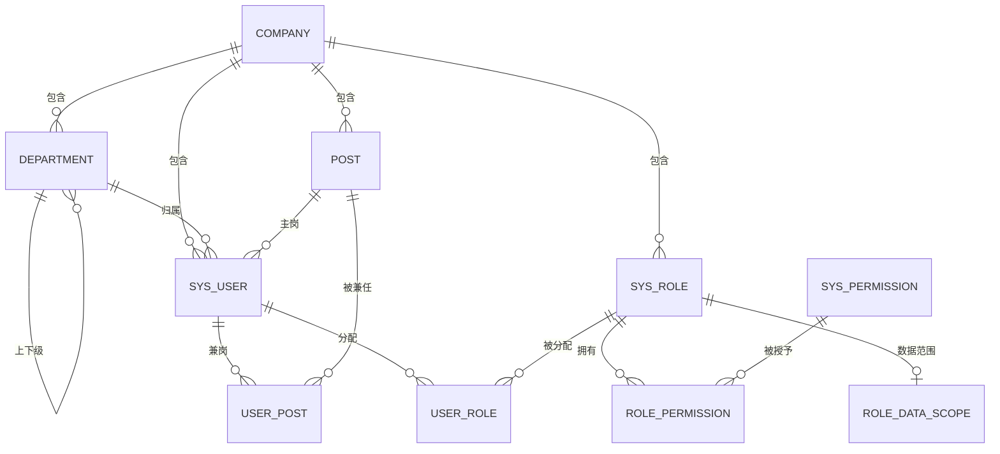
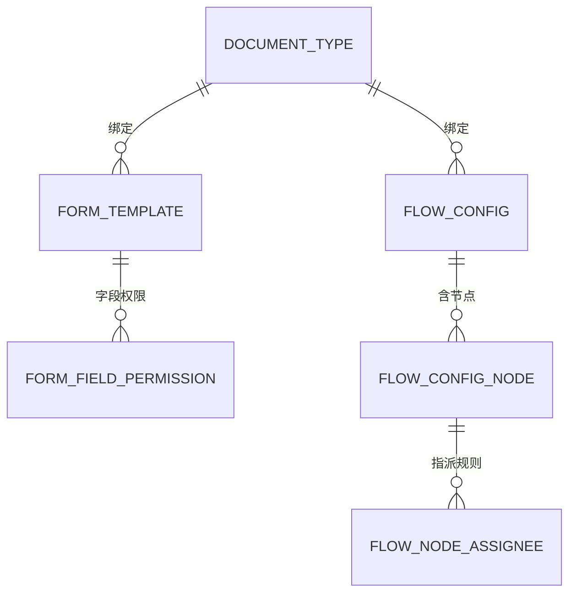
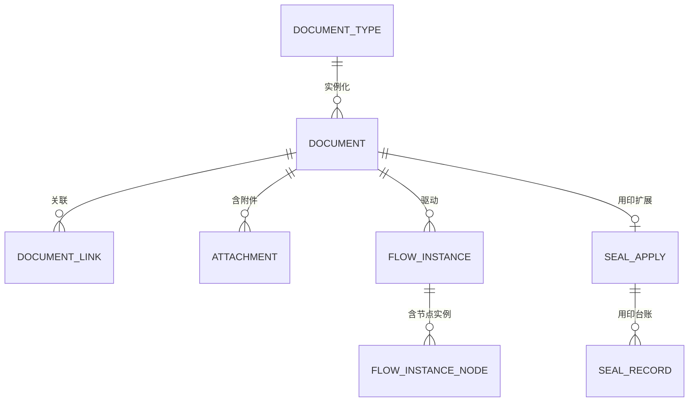

# 海峡金 OA 审批系统 — 数据库设计说明书

| 项目 | 内容 |
|---|---|
| 目标数据库 | MySQL 8.0.16+（InnoDB / utf8mb4 / utf8mb4_0900_ai_ci） |
| 表数量 | 29 张（7 个领域） |
| DDL 脚本 | `sql/schema.sql` |
| 分区脚本 | `sql/schema_partition.sql` |
| 冒烟测试 | `sql/smoke_test.sql` |
| 验证状态 | 已在 MySQL 8.0.46 实际建库、建表、插入与查询验证通过 |

---

## 一、设计原则

1. **主键统一** `id` BIGINT UNSIGNED AUTO_INCREMENT，避免早期 INT 溢出。
2. **多公司隔离**：所有业务表携带 `company_id`，与 `role_data_scope` 配合实现行级数据隔离（海峡金 / 海峡金供应链）。
3. **逻辑外键**：不建物理外键约束，仅靠索引 + 应用层保证，便于后续分区与分库分表。
4. **统一审计字段**：`created_at` / `updated_at` / `created_by` / `updated_by` / `deleted`。
5. **金额精度**：统一 `DECIMAL(18,2)`，禁用 FLOAT / DOUBLE。
6. **逻辑删除**：`deleted` 0=正常 1=已删除；唯一索引均带 `deleted`，避免删除后无法重建同名记录。
7. **版本快照**：表单模板与流程定义均有 `version`，单据提交时快照版本号，保证在途单据不受配置变更影响。
8. **保留字规避**：`comment` / `rank` / `system` 等 MySQL 保留字不作为列名（审批意见用 `comment_text`）。

---

## 二、领域模型

### 2.1 领域划分与表清单

| 域 | 表 | 说明 |
|---|---|---|
| **组织与用户域** | `company` | 公司（海峡金 / 海峡金供应链） |
| | `department` | 部门（中心 → 二级部门，`path` 物化路径） |
| | `post` | 岗位 |
| | `sys_user` | 用户 |
| | `user_post` | 用户兼岗 |
| | `sys_role` | 角色 |
| | `user_role` | 用户-角色 |
| | `sys_permission` | 权限点（功能权限） |
| | `role_permission` | 角色-权限点 |
| | `role_data_scope` | 角色数据范围（行级） |
| **表单域** | `form_template` | 表单模板（JSON Schema，版本化） |
| | `form_field_permission` | 字段级权限（列级） |
| **流程配置域** | `document_type` | 单据类型（约 50 种） |
| | `flow_config` | 流程定义（版本化） |
| | `flow_config_node` | 流程节点定义（含条件网关） |
| | `flow_node_assignee` | 节点指派规则（运行时解析审批人） |
| | `flow_delegation` | 审批委托（我不在时由谁代办） |
| **单据域** | `document` | 单据主表（业务数据 + 当前状态） |
| | `document_link` | 单据关联（前置单据 / 合同） |
| | `attachment` | 附件 |
| **流程运行时域** | `flow_instance` | 流程实例 |
| | `flow_instance_node` | 节点实例（含待办、审批记录） |
| | `flow_escalation` | 超时升级台账（节点超时后把上级加签进来） |
| **用印域** | `seal_apply` | 用印申请 |
| | `seal_record` | 用印台账（用印 / 归还动作） |
| **支撑域** | `sys_dict` | 数据字典 |
| | `code_sequence` | 单据编码序列（防重号） |
| | `audit_log` | 审计日志 |
| | `notification` | 通知 |

### 2.2 ER 图（组织与用户域）



### 2.3 ER 图（表单与流程配置域）



### 2.4 ER 图（单据与流程运行时域）



> `sys_dict` / `code_sequence` / `audit_log` / `notification` 为独立支撑表，不参与主关系链。

---

## 三、数据字典

### 3.1 组织与用户域

#### company — 公司

| 字段 | 类型 | 空 | 说明 |
|---|---|---|---|
| id | BIGINT UNSIGNED | N | 主键 |
| code | VARCHAR(32) | N | 公司编码，如 HXJ / HXJ-GYL |
| name | VARCHAR(64) | N | 公司名称 |
| short_name | VARCHAR(32) | Y | 公司简称 |
| status | TINYINT | N | 1启用 0停用 |
| sort_no | INT | N | 排序号 |
| created_at / updated_at / created_by / updated_by / deleted | — | — | 审计字段 |

索引：`uk_company_code(code, deleted)`

#### department — 部门

| 字段 | 类型 | 空 | 说明 |
|---|---|---|---|
| id | BIGINT UNSIGNED | N | 主键 |
| company_id | BIGINT UNSIGNED | N | 所属公司 |
| parent_id | BIGINT UNSIGNED | N | 上级部门，0=顶级 |
| code | VARCHAR(64) | N | 部门编码 |
| name | VARCHAR(64) | N | 部门名称 |
| dept_type | TINYINT | N | 1一级中心 2二级部门 |
| level | TINYINT | N | 层级深度 |
| path | VARCHAR(512) | N | 物化路径 `/1/5/12/`，便于查子树 |
| leader_id | BIGINT UNSIGNED | Y | **部门负责人**（「取发起人主管」依赖此字段） |
| status / sort_no / 审计字段 | — | — | — |

索引：`uk_dept_company_code(company_id, code, deleted)`、`idx_dept_parent`、`idx_dept_path(path(191))`

#### post — 岗位
字段：`id, company_id, code, name, status, sort_no, 审计字段`
索引：`uk_post_company_code(company_id, code, deleted)`

#### sys_user — 用户

| 字段 | 类型 | 空 | 说明 |
|---|---|---|---|
| id | BIGINT UNSIGNED | N | 主键 |
| company_id | BIGINT UNSIGNED | N | 所属公司 |
| job_no | VARCHAR(32) | N | 工号 |
| account | VARCHAR(64) | N | 登录账号 |
| password | VARCHAR(100) | N | **BCrypt 哈希**，禁止明文/可逆加密 |
| real_name | VARCHAR(32) | N | 姓名 |
| phone / email | VARCHAR | Y | 联系方式 |
| dept_id / post_id | BIGINT UNSIGNED | Y | 所属部门 / 主岗位 |
| status | TINYINT | N | 1在职 0离职 |
| pwd_reset_flag | TINYINT | N | 是否强制改密（首次登录） |
| last_login_at | DATETIME | Y | 最后登录时间 |

索引：`uk_user_account(account, deleted)`、`uk_user_company_jobno(company_id, job_no, deleted)`、`idx_user_dept`

#### user_post / user_role / role_permission — 关联表
三张表均为「双列唯一 + 逻辑删除」结构：
- `user_post(user_id, post_id, dept_id, is_primary)`
- `user_role(user_id, role_id)`
- `role_permission(role_id, perm_code)`

#### sys_role — 角色

| 字段 | 类型 | 说明 |
|---|---|---|
| id / company_id | BIGINT UNSIGNED | 主键 / 所属公司 |
| code | VARCHAR(64) | 角色编码，如 ACCOUNTANT |
| name | VARCHAR(64) | 角色名称，如 核算会计 |
| dept_id | BIGINT UNSIGNED | 归属部门（可空） |
| post_name | VARCHAR(64) | 对应岗位名称 |
| is_builtin | TINYINT | 内置角色不可删 |
| status | TINYINT | 1启用 0停用 |

索引：`uk_role_company_code(company_id, code, deleted)`

#### sys_permission — 权限点

| 字段 | 类型 | 说明 |
|---|---|---|
| code | VARCHAR(128) | **权限点编码，如 `document:view:all`** |
| name | VARCHAR(64) | 中文名称（仅展示） |
| perm_type | TINYINT | 1菜单 2按钮 3接口 |
| parent_code | VARCHAR(128) | 父权限点（菜单树） |

索引：`uk_perm_code(code, deleted)`

> 权限点必须是稳定英文 code，中文只做展示——原型用中文名当权限码，改名即失效。

#### role_data_scope — 角色数据范围（行级权限）

| 字段 | 类型 | 说明 |
|---|---|---|
| role_id | BIGINT UNSIGNED | 角色 |
| scope_type | VARCHAR(32) | `self` / `dept` / `center` / `company` / `custom_dept` |
| company_ids | JSON | 限定公司集合，null=不限 |
| dept_ids | JSON | 限定部门集合（custom_dept 时用） |

> 应用层 `@DataScope` 拦截器读取本表，自动为查询拼 where 条件。

### 3.2 表单域

#### form_template — 表单模板

| 字段 | 类型 | 说明 |
|---|---|---|
| doc_type_id | BIGINT UNSIGNED | 单据类型 |
| name | VARCHAR(64) | 模板名称 |
| version | INT | **版本号**，单据提交时快照 |
| schema_json | JSON | 字段定义 + 显隐规则 + 校验规则 |
| status | TINYINT | 0草稿 1生效 2废弃 |
| effective_from / effective_to | DATETIME | 生效区间 |
| company_id | BIGINT UNSIGNED | 所属公司，null=全局 |

索引：`uk_form_tpl(doc_type_id, version, deleted)`

`schema_json` 结构示例：

```json
{
  "version": 1,
  "fields": [
    { "key": "company",  "label": "所属公司",     "type": "select", "source": "dict:company", "required": true },
    { "key": "amount",   "label": "申请金额(元)", "type": "money",  "required": true },
    { "key": "needPostMaterial", "label": "付款后置材料", "type": "switch" }
  ],
  "rules": [
    { "when": "$.needPostMaterial === true", "require": ["postMaterialDeadline"] }
  ]
}
```

#### form_field_permission — 字段级权限

| 字段 | 类型 | 说明 |
|---|---|---|
| template_id | BIGINT UNSIGNED | 表单模板 |
| node_key | VARCHAR(64) | 节点标识，`*`=所有节点 |
| field_key | VARCHAR(64) | 字段标识 |
| visible | TINYINT | 是否可见 |
| editable | TINYINT | 是否可编辑 |

索引：`uk_field_perm(template_id, node_key, field_key, deleted)`

> 解决「同一张表单，出纳能填回单号、普通审批人只读」。

### 3.3 流程配置域

#### document_type — 单据类型

| 字段 | 类型 | 说明 |
|---|---|---|
| code / name | VARCHAR(64) | 类型编码 / 名称（如 PURCHASE / 采购申请） |
| category | VARCHAR(32) | `DAILY` 日常付款 / `BIZ` 业务付款 / `REIMBURSE` 员工报销 / `SEAL` 用印申请 |
| form_template_id | BIGINT UNSIGNED | 默认表单模板 |
| flow_config_id | BIGINT UNSIGNED | 默认流程配置 |
| must_link_prev | TINYINT | 是否必须关联前置单据 |

索引：`uk_doctype_code(code, deleted)`

#### flow_config — 流程定义

| 字段 | 类型 | 说明 |
|---|---|---|
| doc_type_id | BIGINT UNSIGNED | 单据类型 |
| name / category | VARCHAR | 流程名称 / 分类 |
| version | INT | **版本号**，单据提交时快照 |
| status | TINYINT | 0草稿 1生效 2废弃 |
| effective_from / effective_to | DATETIME | 生效区间 |

索引：`uk_flow_cfg(doc_type_id, version, deleted)`

#### flow_config_node — 流程节点定义

| 字段 | 类型 | 说明 |
|---|---|---|
| flow_config_id | BIGINT UNSIGNED | 流程定义 |
| node_key | VARCHAR(64) | 节点标识（流程内唯一） |
| node_name | VARCHAR(64) | 节点名称 |
| node_type | TINYINT | 1审批 2抄送 3条件网关 4办理 5发起 |
| seq_no | INT | 顺序号 |
| condition_expr | VARCHAR(512) | **分支条件表达式**，如 `amount >= 20000` |
| allow_countersign | TINYINT | 是否允许加签 |
| allow_reject | TINYINT | 是否允许驳回 |
| sla_hours | DECIMAL(6,2) | 处理时限（小时），用于超时预警 |

索引：`uk_flow_node(flow_config_id, node_key, deleted)`

#### flow_node_assignee — 节点指派规则

| 字段 | 类型 | 说明 |
|---|---|---|
| node_id | BIGINT UNSIGNED | 流程节点定义 |
| rule_type | VARCHAR(32) | `initiator_leader` / `dept_role` / `biztype_role` / `role` / `user` / `condition` |
| rule_value | JSON | 规则参数，如 `{"roleCode":"ACCOUNTANT","byDept":true}` |
| sign_mode | TINYINT | 1或签 2会签 3依次审批 |

> **这是权限体系的核心**：审批人不是「角色名匹配节点名」，而是运行时按单据上下文解析。

| rule_type | 解析逻辑 | 解决原型中 |
|---|---|---|
| `initiator_leader` | 取发起人所在部门的 `leader_id` | 「直属主管」「逐级主管」 |
| `dept_role` | 按角色 + 部门维度取人 | 「会计（按部门）」 |
| `biztype_role` | 按角色 + 业务类型取人 | 「会计（按业务类型）」 |
| `role` | 取该角色下所有人 | 「内控专员」 |
| `user` | 直接指定人 | 指定审批人 |
| `condition` | 满足表达式才生成节点 | 「公司领导（大额）」 |

#### flow_delegation — 审批委托

| 字段 | 类型 | 说明 |
|---|---|---|
| delegator_id / delegate_id | BIGINT UNSIGNED | 委托人（原承办人） / 受托人（代办人） |
| biz_category | VARCHAR(32) | 限定单据业务类别；NULL = 全部 |
| start_at / end_at | DATETIME | 生效区间 |
| status | TINYINT | 1生效 0已撤销 |

索引：`idx_deleg_delegate(delegate_id, status, start_at, end_at)`、`idx_deleg_delegator(delegator_id, status, ...)`

> 生效方式是「**待办可见 + 审批放行**」，**不改写流程的指派结果**：节点 assignee 仍是原承办人，
> 流程历史里"谁审的"不会被换人。代价是委托**不追溯**已有待办之外的记录，但避免了
> "指派被改写后历史记录里承办人含义变味"这类更难解释的问题。
> 类别匹配读的是 `flow_instance.biz_category` 快照列，**fail-safe**：类别取错 = 委托不生效，绝不放宽。

### 3.4 单据域

#### document — 单据主表

| 字段 | 类型 | 说明 |
|---|---|---|
| doc_no | VARCHAR(32) | **单据编号，全局唯一**（`FK/YY/BX + 日期 + 序号`） |
| company_id | BIGINT UNSIGNED | 所属公司（多公司隔离） |
| doc_type_id | BIGINT UNSIGNED | 单据类型 |
| business_category | VARCHAR(32) | 业务大类 |
| title | VARCHAR(128) | 申请事项 / 对应项目 |
| applicant_id / applicant_name | BIGINT / VARCHAR | 申请人 ID / 姓名（冗余） |
| dept_id / dept_name | BIGINT / VARCHAR | 申请部门 ID / 名称（冗余） |
| amount | DECIMAL(18,2) | 申请金额 |
| reason | TEXT | 申请事由 |
| invoice_summary | VARCHAR(500) | 简易发票明细 |
| form_data | JSON | **动态表单字段值**（按模板 Schema 渲染） |
| form_template_id / form_template_ver | BIGINT / INT | 表单模板版本快照 |
| need_post_material | TINYINT | 是否需付款后置材料 |
| post_material_status | TINYINT | 0无需 1待补 2已补 |
| status | TINYINT | **0草稿 1待审批 2审批中 3已通过 4已驳回 5已撤回 6已归档** |
| current_node_key / current_node_name | VARCHAR | 当前节点 |
| flow_instance_id | BIGINT UNSIGNED | 当前流程实例 |
| priority / deadline | TINYINT / DATETIME | 紧急度 / 时效截止 |
| submitted_at / closed_at | DATETIME | 提交 / 办结时间 |

索引：`uk_document_no(doc_no, deleted)`、`idx_doc_company_status`、`idx_doc_applicant`、`idx_doc_dept`、`idx_doc_created`、`idx_doc_amount(company_id, amount)`

#### document_link — 单据关联
字段：`document_id, linked_id, link_type(prev_doc|contract), 审计字段`
索引：`uk_doc_link(document_id, linked_id, link_type, deleted)`

#### attachment — 附件
字段：`document_id, node_key, biz_type(apply|approve|seal|receipt), file_name, file_key, file_size, mime_type, uploader_id, uploader_name`
索引：`idx_attach_doc(document_id, biz_type)`、`idx_attach_node(document_id, node_key)`

### 3.5 流程运行时域

#### flow_instance — 流程实例

| 字段 | 类型 | 说明 |
|---|---|---|
| document_id | BIGINT UNSIGNED | 单据 |
| flow_config_id / flow_config_version | BIGINT / INT | **流程定义版本快照** |
| status | TINYINT | 1运行中 2已完成 3已终止 |
| current_node_key | VARCHAR(64) | 当前节点 |
| biz_category | VARCHAR(32) | **业务类别快照**（审批委托按类别匹配授权时要读它，刻意冗余） |
| proc_inst_id / business_key | VARCHAR(64) | Flowable 实例 ID / 业务键（= `document.doc_no`，业务表 ↔ 引擎表的唯一桥接键） |
| started_at / ended_at | DATETIME | 起止时间 |

> 驳回重提会产生**新实例**，历史实例保留，流程痕迹不丢。

#### flow_instance_node — 节点实例

| 字段 | 类型 | 说明 |
|---|---|---|
| instance_id / document_id | BIGINT UNSIGNED | 流程实例 / 单据 |
| node_key / node_name / node_type / seq_no | — | 节点定义快照 |
| status | TINYINT | **0待处理 1处理中 2已通过 3已驳回 4已跳过 5已抄送** |
| assignee_id / assignee_name | BIGINT / VARCHAR | 实际处理人 |
| candidate_ids | JSON | 候选处理人（会签/或签） |
| action | VARCHAR(32) | `approve` / `reject` / `countersign` / `supplement` / `cc` |
| comment_text | VARCHAR(1000) | 审批意见（`comment` 是保留字，故用 `comment_text`） |
| reject_level | VARCHAR(32) | 驳回目标层级 |
| materials | VARCHAR(500) | 要求补充的材料 |
| deadline / action_at | DATETIME | 处理时限 / 处理时间 |

索引：`idx_node_inst(instance_id, seq_no)`、**`idx_node_todo(assignee_id, status)`（待办查询核心索引）**、`idx_node_doc`

#### flow_escalation — 超时升级台账

字段：`document_id, instance_id, node_id, node_key, node_name, task_id, from_assignee_id, to_assignee_id, status(1已升级 0未找到上级负责人), reason`

索引：**`uk_escalation_node(node_id, deleted)`**、`idx_escalation_doc(document_id)`

> **幂等靠唯一键而不是"先查再插"**：一个节点最多一条升级记录，重复执行只会撞 `uk_escalation_node`
> （代码把它当"已升级过"处理）。定时任务与手动触发并发时，"先查再插"会重复升级。
> 升级动作是**加签给上级部门负责人**，不是改派 —— 原承办人仍在流程历史里。
> ⚠ 该功能**默认 `enabled=false`**（客户需求未确认），手动触发不受限。

### 3.6 用印域

#### seal_apply — 用印申请
字段：`document_id, seal_project, seal_dept_id, seal_time, file_name, seal_type(公章/合同章/法人章/财务专用章/发票专用章), seal_reason, return_status(0待用印 1已用印 2已归还), return_at`
索引：`uk_seal_doc(document_id, deleted)`、`idx_seal_return`

#### seal_record — 用印台账
字段：`seal_apply_id, document_id, action(use|return), operator_id, operator_name, action_at, remark`
索引：`idx_seal_rec_apply(seal_apply_id, action)`

> 用印闭环：申请 → 用印 → **归还**，归还状态与台账动作分离，可追溯超期未归还。

### 3.7 支撑域

#### sys_dict — 数据字典
字段：`company_id, dict_type(project|seal_type|...), dict_code, dict_label, sort_no, status`
索引：`uk_dict(dict_type, dict_code, company_id, deleted)`

#### code_sequence — 单据编码序列
字段：`company_id, biz_prefix(FK|YY|BX), period(如 20260826), current_val`
索引：**`uk_code_seq(company_id, biz_prefix, period)`**

> 配合 Redis 分布式锁 `INCR`，杜绝并发下的单据号重号。

#### audit_log — 审计日志
字段：`company_id, user_id, user_name, module, action, biz_id, detail(JSON), ip, user_agent, created_at`
索引：`idx_audit_biz(biz_id)`、`idx_audit_user(user_id, created_at)`、`idx_audit_created`
> 只追加、无唯一性诉求，是**分区的最佳候选**（见 `schema_partition.sql`）。

#### notification — 通知
字段：`company_id, receiver_id, title, content, notify_type(todo|cc|risk|result), biz_type, biz_id, channel(inner|mail|sms), is_read, read_at`
索引：`idx_notify_receiver(receiver_id, is_read, created_at)`、`idx_notify_biz`

---

## 四、关键设计说明

### 4.1 多公司隔离（海峡金 / 海峡金供应链）
所有业务表携带 `company_id`；查询层通过 `@DataScope` 拦截器按 `role_data_scope` 自动注入条件，业务代码不手写 `company_id`，杜绝漏写导致的数据越权。MySQL 无 RLS，本拦截器是**唯一防线**，需配合 SQL 审计插件在 CI 阶段扫描漏加条件的查询。

### 4.2 动态表单的存储与查询
- 低频/展示型字段 → 存 `form_data` JSON。
- **高频查询字段（`doc_type_id`、`company_id`、`dept_id`、`status`、`amount`）已提为独立列**，不放入 JSON，避免全表扫描。
- 若确有 JSON 内字段查询需求，用生成列 + 索引：
  ```sql
  ALTER TABLE form_template
    ADD COLUMN doc_type_v VARCHAR(64)
      GENERATED ALWAYS AS (schema_json->>'$.docType') STORED,
    ADD INDEX idx_doc_type_v (doc_type_v);
  ```

### 4.3 流程版本快照
单据提交时同时写入 `form_template_id + form_template_ver`、`flow_instance.flow_config_id + flow_config_version`。**配置变更不影响在途单据**，这是原型完全缺失的一环。

### 4.4 单据编码与并发
`code_sequence` 表按 `(company_id, biz_prefix, period)` 维度维护序号。并发场景：
```
Redis 锁 code:FK:20260826 → SELECT ... FOR UPDATE → current_val+1 → 拼码 → 释放锁
```
`document.doc_no` 的唯一索引作为最后一道兜底。

### 4.5 分区策略
- **`audit_log` 推荐分区**（按月 `TO_DAYS(created_at)`），冷数据 `DROP PARTITION` 秒级归档。
- **`document` 默认不分区**：分区要求主键含分区列，会导致 `doc_no` 跨分区唯一性失效。单表超千万行再评估，改用归档表或分库分表。
- 这是 MySQL 相对 PostgreSQL 的一个隐性代价，需提前知悉。

### 4.6 索引设计要点
- 待办查询走 `flow_instance_node(assignee_id, status)` 覆盖索引，是最高频查询。
- 列表页筛选走 `document(company_id, status)` 复合索引。
- 台账按 `amount` 区间与 `created_at` 排序，分别建索引。
- 所有唯一索引带 `deleted`，支持逻辑删除后重建同名记录。

---

## 五、验证记录

已在本地 MySQL 8.0.46 实例完成验证：

| 验证项 | 结果 |
|---|---|
| `schema.sql` 建库建表 | ✅ 29 张表全部创建，零错误（新装结构与演示库列级零差异） |
| `smoke_test.sql` 数据链路 | ✅ 组织→权限→模板→流程→单据→待办 全链路插入成功 |
| JSON 字段读写（动态表单） | ✅ `form_data->>'$.project'` 正确取值，`JSON_LENGTH` = 5 |
| 表单 Schema 结构 | ✅ `schema_json->'$.fields[0].key'` = `"company"` |
| 角色 × 权限点 | ✅ 三角色权限聚合正确 |
| 数据范围（行级） | ✅ `custom_dept` 的 `dept_ids` = `[2]` 正确存储 |
| 流程节点 + 指派规则 | ✅ 条件表达式 `amount >= 20000`、`dept_role` 规则 JSON 正确 |
| `schema_partition.sql` 分区 | ✅ `audit_log` 按月分成 7 个分区，数据正确落入 p202609 |
| 待办查询 | ✅ 按 `assignee_id + status` 命中待办 |
